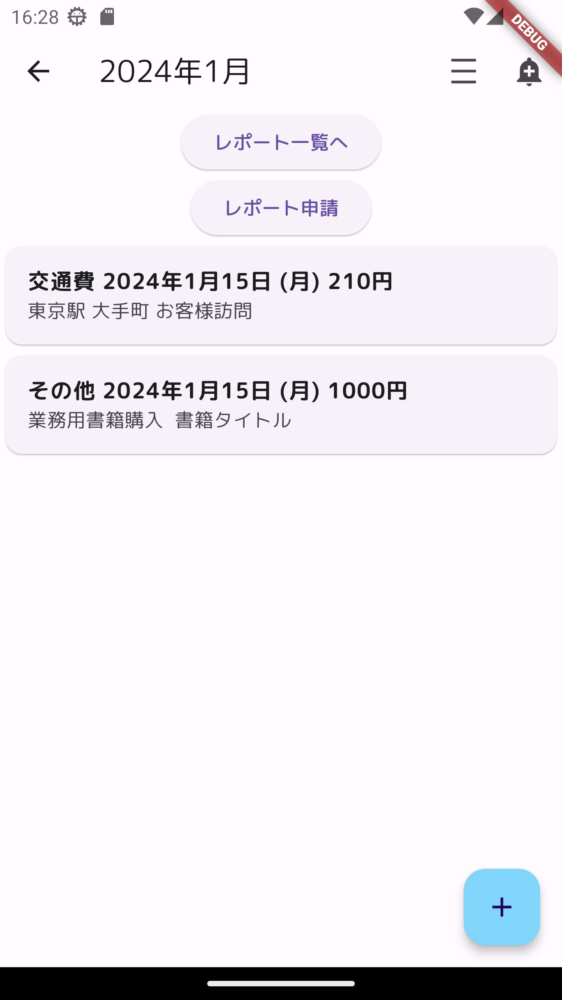
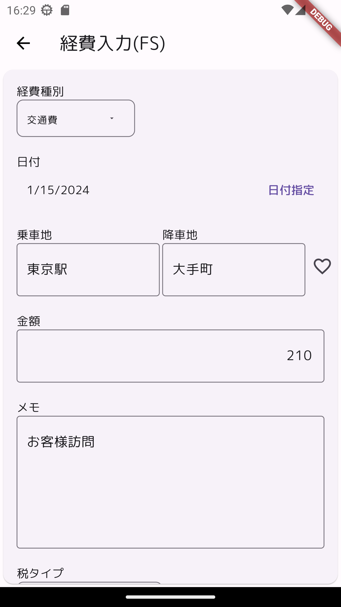
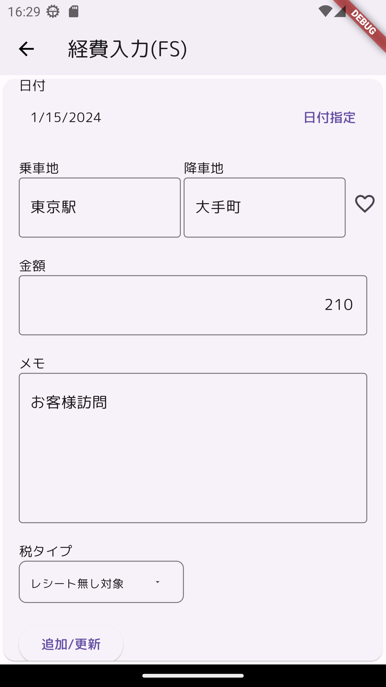
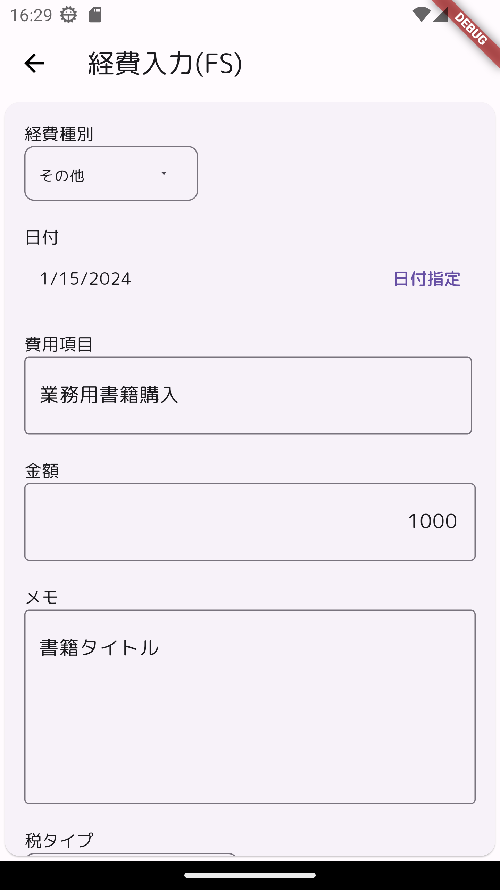

# riverpodtest

経費精算モックアップ

flutter(riverpod、go_router、freezed)、firebase/firestoreを具体的に使ってみる。
具体化の策として簡易な経費精算アプリを作成する。

デザインについては凝らない。

## 利用コンポーネント

- flutter
- riverpod
- freezed
- firebase
- firestore
- firebaseエミュレーター

## 画面イメージ
### 経費精算ホーム
ログインした状態。選択可能は『ログアウト』と『レポート一覧』だけ。ログイン前は『ログイン』だけが選択可能になっている。
|  |
| ------------------------------------------------ |

### 経費レポート一覧
経費レポート一覧。ステータスは『申請済み』と『作成中』があり、『申請済み』は

### 経費一覧

## その他
以下の点は課題。
- goRouterでのパラメータ渡し
  画面呼出し時、パラメータをテキストに変換している点が効率的ではない。
- firebase、firestoreでのサーバーステータスの確認
  エミュレータを使っているが、