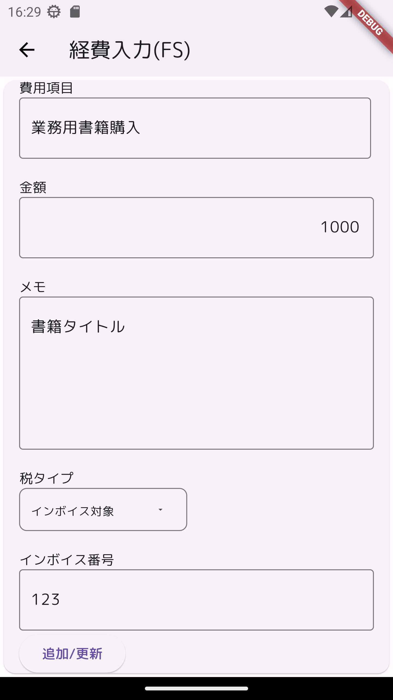

# riverpodtest

経費精算モックアップ

flutter(riverpod、go_router、freezed)、firebase/firestoreを具体的に使ってみる。
具体化の策として簡易な経費精算アプリを作成する。

## 利用コンポーネント

    flutter
    riverpod
    freezed
    firebase
    firestore
    firebaseエミュレーター

<!--  -->

