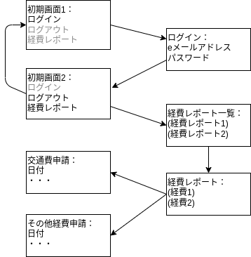
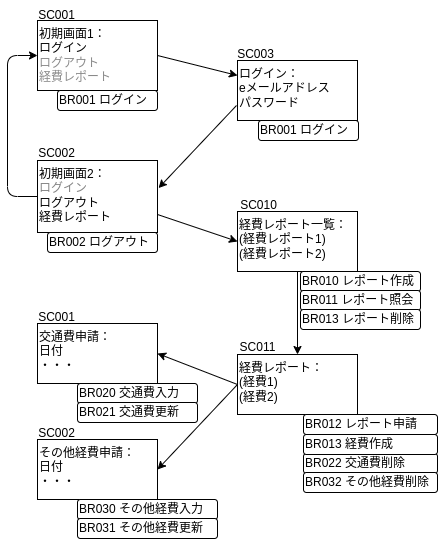
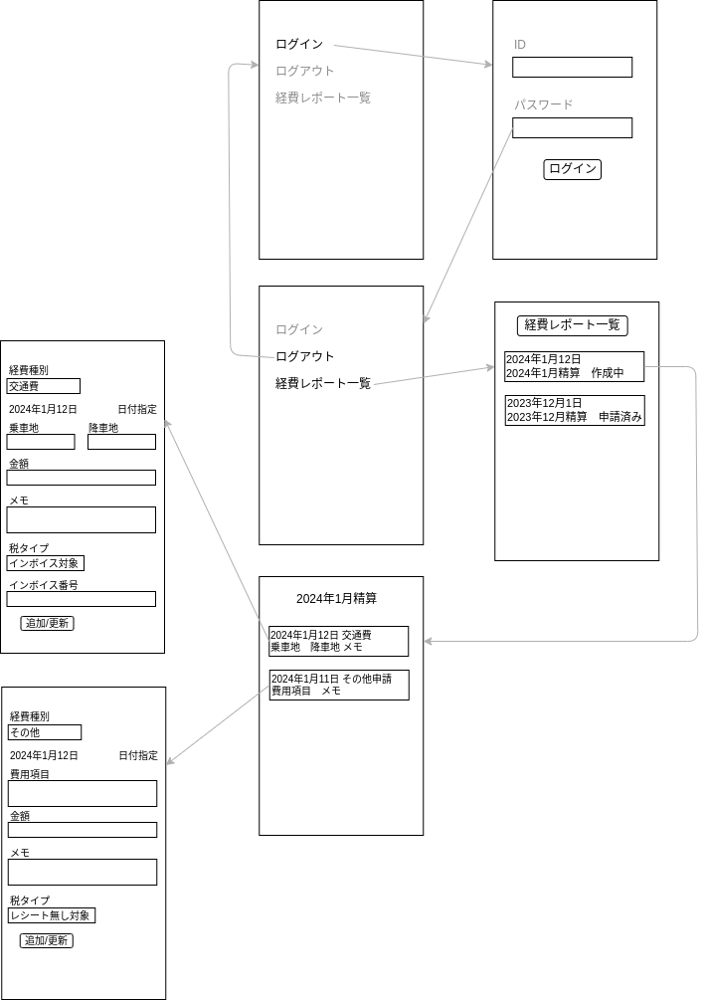

# 要件

## システム化の目的
flutter(riverpod、go_router、freezed)、firebase/firestoreを具体的に使ってみる。
具体化の策として簡易な経費精算アプリを作成する。

<!--
目的を簡潔に記載。
-->
<!-- 簡単なポンチ絵＝構成概要。ユーザーが左にいて、スマホアプリがあって、右にgoogle -->

## 業務要件

<!-- 「一覧」：表を作る。管理番号、名称、説明、実行(ユーザー、システム)を記載する -->
<!-- 「フロー図」：登場人物=ユーザー、システム、管理者 　　簡単なものも記載する-->
ユーザーはログイン後、経費申請用レポートを作成し、そのレポート内で関係する経費を入力する。
経費入力後レポートを申請する。申請後は経費を入力、変更、削除できない。

| ID    | 名称           | 説明                                 | 実行     |
| :---- | :------------- | :----------------------------------- | :------- |
| BR001 | ログイン       | メールアドレス、パスワードでログイン | ユーザー |
| BR002 | ログアウト     | ログアウト                           | ユーザー |
| BR003 | ユーザー管理   | メールアドレス、パスワード登録       | 管理者   |
| BR010 | レポート作成   | 経費申請用レポート作成               | ユーザー |
| BR011 | レポート照会   | 経費申請用レポート照会               | ユーザー |
| BR012 | レポート申請   | 経費申請用レポート申請               | ユーザー |
| BR013 | レポート削除   | 経費申請用レポート削除               | ユーザー |
| BR014 | 経費作成       | 経費作成                             | ユーザー |
| BR020 | 交通費入力     | レポート内で交通費入力               | ユーザー |
| BR021 | 交通費更新     | レポート内で交通費更新               | ユーザー |
| BR022 | 交通費削除     | レポート内で交通費削除               | ユーザー |
| BR030 | その他経費入力 | レポート内でその他経費入力           | ユーザー |
| BR031 | その他経費更新 | レポート内でその他経費更新           | ユーザー |
| BR032 | その他経費削除 | レポート内でその他経費削除           | ユーザー |

### BR001 ログイン
メールアドレス、パスワードでログインする。

BR001-1 メールアドレス、パスワードでログイン

### BR002 ログアウト
ログアウトする

BR002-1 ログアウト

### BR003 ユーザー管理

ユーザー(メールアドレス、パスワード)を登録、更新、削除する。

BR003-1 ユーザー登録
BR003-2 ユーザー更新
BR003-3 ユーザー削除

### BR010 レポート作成

関連する複数の経費をまとめるレポートを作成する。
レポートを作成すると経費を申請できるようになる。
レポートは作成中、申請済み、その他の 3 つのステータスを持つ。
ユーザーがレポートを作成すると作成中となる。ユーザーが申請すると申請済みとなる。
ユーザーと管理者は申請済みレポートを作成中にできる。
管理者は申請済みをその他に変更できる。

BR010-1 レポート作成(ユーザー)
BR010-2 レポート申請(ユーザー)
BR010-3 レポート差戻し(ユーザー)
BR010-4 レポート差戻し(管理者)
BR010-5 レポートその他化(管理者)
BR010-6 レポート作成後経費申請(ユーザー)
BR010-7 レポートステータス（作成中）
BR010-8 レポートステータス（申請済み）
BR010-8 レポートステータス（その他）

### BR0011 レポート照会

レポート照会では、まずレポート一覧画面が表示される。
レポート一覧画面では日付(レポート作成日)、レポート名称、ステータスを表示する2。
特定のレポートをクリックするとそのレポートの経費が表示される。
特定のレポートの表示では経費種別に応じ以下の項目が表示される。
・交通費：経費種別、日付、金額、乗車地、降車地、メモを表記
・その他：経費種別、日付、金額、メモを表記

BR011-1 レポート一覧表示
BR011-2 レポート一覧表示のレポート情報(作成日、名称、ステータス)
BR011-3 一覧から特定レポートの表示
BR011-4 特定レポートでの経費一覧表示
BR011-5 特定レポートでの交通費エントリー表示(経費種別、日付、金額、乗車地、降車地、メモを表記)
BR011-6 特定レポートでのその他経費エントリー表示(経費種別、日付、金額、メモを表記)

### BR012 レポート申請

レポートを申請する。
申請後のレポートも照会できるが変更はできない。

BR012-1 特定レポートを申請
BR012-2 申請後経費は照会のみで削除できない
BR012-3 申請後経費は照会のみで変更できない

### BR013 レポート削除
経費申請用レポートを削除する。

BR013-1 作成中の特定レポートの削除
BR013-2 申請済みレポートは削除できない

### BR020 交通費入力、BR021交通費更新、BR022 交通費削除

以下の項目を入力、選択。

・経費種別=交通費(選択)
・日付(選択)
・乗車地
・降車地
・金額
・メモ
・税タイプ インボイス対象、レシート無し対象、その他(選択)
・インボイス番号 (税タイプ=インボイス対象の場合)

BR020-1 経費種別で交通費選択
BR020-2 日付選択
BR020-3 乗車地入力
BR020-4 降車地入力
BR020-5 金額入力
BR020-6 メモ入力
BR020-7 税タイプ選択
BR020-8 インボイス番号入力

### BR021 交通費更新
BR020で入力された交通費を更新

BR021-1 経費種別で交通費選択
BR021-2 日付選択
BR021-3 乗車地入力
BR021-4 降車地入力
BR021-5 金額入力
BR021-6 メモ入力
BR021-7 税タイプ選択
BR021-8 インボイス番号入力

### BR022 交通費削除
入力、更新された交通費を削除

BR022-1 交通費エントリー削除

### BR030 その他経費入力

以下の項目を入力、選択。

・経費種別=その他(選択)
・日付(選択)
・費用項目
・金額
・メモ
・税タイプ インボイス対象、レシート無し対象、その他(選択)
・インボイス番号 (税タイプ=インボイス対象の場合)

BR030-1 経費種別でその他選択
BR030-2 日付選択
BR030-3 費用項目入力
BR030-4 金額入力
BR030-5 メモ入力
BR030-6 税タイプ選択
BR030-7 インボイス番号入力

### BR031 その他経費更新
BR030で入力されたその他経費を更新

BR031-1 経費種別でその他選択
BR031-2 日付選択
BR031-3 費用項目入力
BR031-4 金額入力
BR031-5 メモ入力
BR031-6 税タイプ選択
BR031-7 インボイス番号入力

### BR032 その他経費削除
入力、更新されたその他経費を削除

BR032-1 その他経費削除

### 画面遷移

## 機能要件

<!-- 業務要件一覧に対応する
管理番号、業務要件管理番号  名称、説明、分類、 補足　
補足例：レスポンシブにする。アラート機能で通知
-->
<!-- 機能要件補足　：　構成概要を基に補足する。UIの簡単なポンチ絵、機能要件管理番号を追記する -->
<!-- 非機能要件
可用性、性能、セキュリティ、移行、保守性、その他留意事項、アクセシビリティ、操作性、実現方式、運用　
管理番号、要件/根拠、補足-->

| 画面 ID | 名称             | 業務要件                                                     |
| ------- | ---------------- | ------------------------------------------------------------ |
| FR001   | 初期画面 1       | BR001 ログイン                                               |
| FR002   | 初期画面 2       | BR002 ログアウト(FR001 と同じ画面だが選べる項目が異なる)     |
| FR003   | ログイン         | BR001 ログイン                                               |
| FR010   | 経費レポート一覧 | BR010 レポート作成、BR011 レーポート照会、BR013 レポート削除 |
| FR011   | 経費レポート     | BR012 レポート申請、BR022 交通費削除、BR032 その他経費削減   |
| FR020   | 交通費申請       | BR020 交通費入力、BR021 交通費更新                           |
| FR030   | その他経費入力   | BR030 その他経費入力、BR031 その他経費更新                   |

BR003 は Firebase インターフェースを利用する。

### 画面遷移

### FR001 初期画面 1
BR001 ログイン

| 表示         | ID       | 説明                       | ステータス                         |
| ------------ | -------- | -------------------------- | ---------------------------------- |
| ログイン     | FR001-01 | ログイン画面へ遷移         | ログインしていない場合イネーブル   |
| ログアウト   | FR001-02 | ログアウトする             | ログインしていない場合ディエーブル |
| 経費レポート | FR001-03 | 経費レポート一覧画面へ遷移 | ログインしていない場合ディエーブル |

### FR002 初期画面 2
BR002 ログアウト(FR001 と同じ画面だが選べる項目が異なる)
| 表示         | ID       | 説明                       | ステータス                         |
| ------------ | -------- | -------------------------- | ---------------------------------- |
| ログイン     | FR002-01 | ログイン画面へ遷移         | ログインしていない場合ディエーブル |
| ログアウト   | FR002-02 | ログアウトする             | ログインしていない場合イネーブル   |
| 経費レポート | FR002-03 | 経費レポート一覧画面へ遷移 | ログインしていない場合イネーブル   |

BR002-1 ログアウト

### FR003 ログイン
BR001 ログイン

| 表示             | ID      | 説明 | ステータス   |
| ---------------- | ------- | ---- | ------------ |
| e メールアドレス | FR003-1 | 入力 | 未入力時警告 |
| パスワード       | FR003-2 | 入力 | 未入力時警告 |

BR001-1 メールアドレス、パスワードでログイン

### FR010 経費レポート一覧
BR010 レポート作成、BR011 レーポート照会、BR013 レポート削除
| 表示             | ID        | 説明                             |
| ---------------- | --------- | -------------------------------- |
| レポート一覧     | FR010-001 | 名称、レポート作成日、ステータス |
| 新規レポート作成 | FR010-002 | ボタン                           |
| レポート表示     | FR010-003 | クリックで特定のレポートを表示   |
| レポート削除     | FR010-004 | 一覧内のエントリーを左へスワイプ |
| 戻る             | FR010-005 | 初期画面へ戻る                   |

BR010-1 レポート作成
BR011-1 レポート一覧表示
BR011-2 レポート一覧表示のレポート情報(作成日、名称、ステータス)
BR011-3 一覧から特定レポートの表示
BR013-1 特定レポートの削除

### FR011 経費レポート
BR012 レポート申請、BR022 交通費削除、BR032 その他経費削減
| 表示             | ID       | 説明                                             |
| ---------------- | -------- | ------------------------------------------------ |
| 経費一覧         | BR011-01 | あれば経費を一覧表示                             |
| 経費削除         | BR011-02 | 一覧内のエントリーを左へスワイプ                 |
| 新規経費作成     | BR011-03 | ボタン                                           |
| 申請             | BR011-04 | ボタン                                           |
| 差戻し           | BR011-05 | ボタン                                           |
| 交通費エントリ   | BR011-06 | 経費種別、日付、金額、乗車地、降車地、メモを表記 |
| その他エントリ   | BR011-07 | 経費種別、日付、金額、メモを表記                 |
| 交通費削除       | BR011-08 | 交通費エントリーを削除                           |
| その他作成中     | BR011-09 | その他エントリーを削除                           |
| 申請後交通費削除 | BR011-10 | 更新できない                                     |
| 申請後その他削除 | BR011-11 | 削除でいない                                     |
| 戻る             | BR011-12 | 経費レポート一覧画面へ戻る                       |

BR010-2 レポート申請(ユーザー)、BR012-1 特定レポートを申請
BR010-3 レポート差戻し(ユーザー)
BR011-4 特定レポートでの経費一覧表示
BR011-5 特定レポートでの交通費エントリー表示(経費種別、日付、金額、乗車地、降車地、メモを表記)
BR011-6 特定レポートでのその他経費エントリー表示(経費種別、日付、金額、メモを表記)
BR012-2 申請後経費は照会のみ
BR022-1 交通費エントリー削除
BR032-1 その他経費削除

### FR020 交通費申請
BR020 交通費入力、BR021 交通費更新

| 表示           | ID        | 説明                                                                                 |
| -------------- | --------- | ------------------------------------------------------------------------------------ |
| 経費種別       | FR020-001 | デフォルトは交通費。交通費を選択できる                                               |
| 日付           | FR020-002 | デフォルトは当日。当日以前の日付を選択できる                                         |
| 乗車地         | FR020-003 | 経費種別=交通費の場合入力できる。未入力時"乗車地を入力してください"                  |
| 降車地         | FR020-004 | 経費種別=交通費の場合入力できる。未入力時"乗車地を入力してください"                  |
| 金額           | FR020-005 | 半角数字を入力できる。未入力時"半角数字を入力してください"                           |
| メモ           | FR020-006 | 入力できる                                                                           |
| 税タイプ       | FR020-007 | デフォルトはインボイス対象。インボイス対象を選択できる                               |
| インボイス番号 | FR020-008 | 税タイプ=インボイス対象の際のみ入力。未入力時"インボイス番号(3桁)を入力してください" |
| 経費種別変更   | FR020-009 | 作成中レポートの経費種別交通費の選択をその他に変更できる                             |
| 日付変更       | FR020-010 | 作成中レポートの日付を変更できる                                                     |
| 乗車地変更     | FR020-011 | 作成中レポートの乗車地を変更できる                                                   |
| 降車地変更     | FR020-012 | 作成中レポートの降車地を変更できる                                                   |
| メモ変更       | FR020-013 | 作成中レポートのメモを変更できる                                                     |
| 税タイプ変更   | FR020-014 | 作成中レポートの税タイプインボイス対象を変更できる                                   |
| 戻る           | FR020-015 | 特定レポート画面に戻る                                                               |

BR020-1 経費種別で交通費選択
BR020-2 日付選択
BR020-3 乗車地入力
BR020-4 降車地入力
BR020-5 金額入力
BR020-6 メモ入力
BR020-7 税タイプ選択
BR020-8 インボイス番号入力

BR020で入力された交通費を更新
BR021-1 経費種別で交通費選択
BR021-2 日付選択
BR021-3 乗車地入力
BR021-4 降車地入力
BR021-5 金額入力
BR021-6 メモ入力
BR021-7 税タイプ選択
BR021-8 インボイス番号入力

### FR030 その他経費入力
BR030 その他経費入力、BR031 その他経費更新

| 表示           | ID        | 説明                                                                                 |
| -------------- | --------- | ------------------------------------------------------------------------------------ |
| 経費種別       | FR030-001 | デフォルトは交通費。その他を選択できる                                               |
| 日付           | FR030-002 | デフォルトは当日。当日以前の日付を選択できる                                         |
| 費用項目       | FR030-003 | 経費種別=その他の場合入力できる。未入力時"費用項目を入力してください"                |
| 金額           | FR030-005 | 半角数字を入力できる。未入力時"半角数字を入力してください"                           |
| メモ           | FR030-006 | 入力できる                                                                           |
| 税タイプ       | FR030-007 | デフォルトはインボイス対象。インボイス対象を選択できる                               |
| インボイス番号 | FR030-008 | 税タイプ=インボイス対象の際のみ入力。未入力時"インボイス番号(3桁)を入力してください" |
| 経費種別変更   | FR030-009 | 作成中レポートの経費種別その他の選択を交通費に変更できる                             |
| 日付変更       | FR030-010 | 作成中レポートの日付を変更できる                                                     |
| 費用項目変更   | FR030-011 | 作成中レポートの費用項目を変更できる                                                 |
| メモ変更       | FR030-013 | 作成中レポートのメモを変更できる                                                     |
| 税タイプ変更   | FR030-014 | 作成中レポートの税タイプインボイス対象を変更できる                                   |
| 戻る           | FR020-015 | 特定レポート画面に戻る                                                               |

BR030-1 経費種別でその他選択
BR030-2 日付選択
BR030-3 費用項目入力
BR030-4 金額入力
BR030-5 メモ入力
BR030-6 税タイプ選択
BR030-7 インボイス番号入力
BR030で入力されたその他経費を更新

BR031-1 経費種別でその他選択
BR031-2 日付選択
BR031-3 費用項目入力
BR031-4 金額入力
BR031-5 メモ入力
BR031-6 税タイプ選択
BR031-7 インボイス番号入力

<!-- ## 外部機能（目に見える機能：画面、帳票等） -->

<!-- ## 内部機能（目に見えない機能：データ、I/F、バッチ、外部連携等） -->

## 方式

- flutter UI
  - riverpod ステータス管理
  - gorouter 画面遷移
  - freezed モデル
- firebase ユーザー管理
- firestore データベース
- firebase/firestoreエミュレーター

### firestore 構造

/users/XXX/reports/YYY/expences/ZZZ
#### users属性
Firebaseへユーザー登録
eメールアドレス、パスワード認証

#### reports属性

reports
col1 string
createdDate timestamp
name string
reportID string
status string
totalPriceStr string
userID string

#### expences属性

col1 string
col3 string
createdDate timestamp
expenceDate timestamp
expenceType number
id string
invoiceNumber string
price number
reportID string
taxType number
userID string

<!-- ## 非機能要件 -->

<!-- ## 可用性 -->

<!-- ## 性能 -->

<!-- ## セキュリティー -->

## シーケンス図

## モジュール情報
### main.dart
flutter main()
firebaseエミュレーター初期化
goRouter設定
ログイン

### firebase_data_get.dart
addTestReports()
addNewReport()
#### build()
QuerySnapshotセット
StreamBuilder
ListView
(when dismissed)Firestore delete()
(when dismissed)totalPrice計算
(when onTap)FireStoreSetData

### expencesscreenfs.dart
queryTotalPrice() 未使用
addNewExpence()
#### addTestData()
(when dismissed)totalPrice計算
申請時Firestore update()
QuerySnapshotセット
StreamBuilder
ListView
ここから

